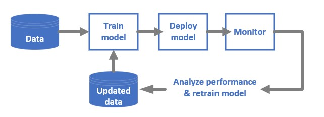
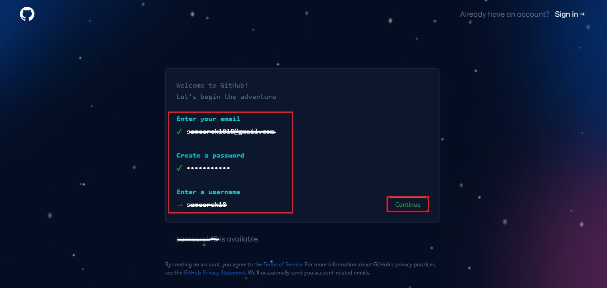
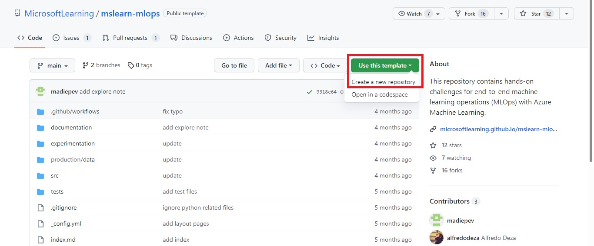
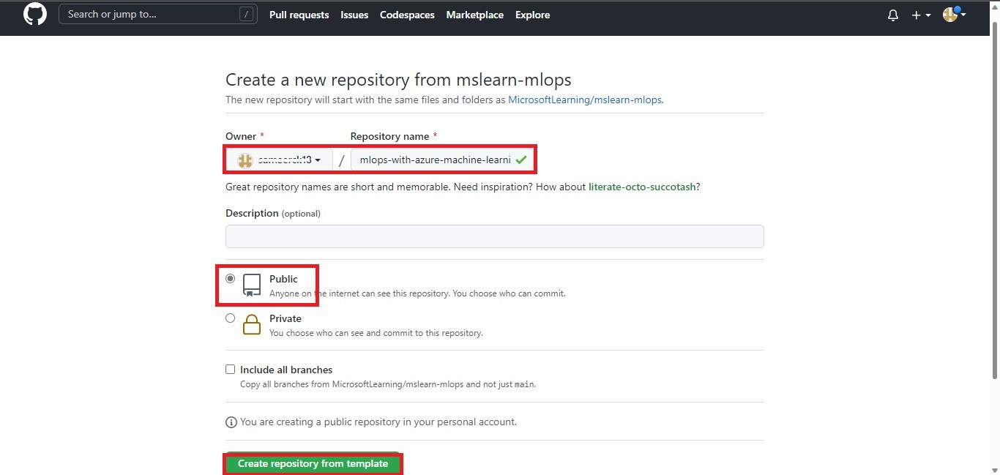

# Using an Azure Machine Learning job for automation
Azure Machine Learning is a cloud service for accelerating and managing the machine learning project lifecycle. Machine learning professionals, data scientists, and engineers can use it in their day-to-day workflows: Train and deploy models, and manage MLOps.

You can create a model in Azure Machine Learning or use a model built from an open-source platform, such as Pytorch, TensorFlow, or scikit-learn. MLOps tools help you monitor, retrain, and redeploy models.

## MLOps: DevOps for machine learning
DevOps for machine learning models, often called MLOps, is a process for developing models for production. A model's lifecycle from training to deployment must be auditable if not reproducible.
### ML model lifecycle



### Integrations enabling MLOPs
Azure Machine Learning is built with the model lifecycle in mind. You can audit the model lifecycle down to a specific commit and environment.

Some key features enabling MLOps include:

- git integration
- MLflow integration
- Machine learning pipeline scheduling
- Azure Event Grid integration for custom triggers
- Easy to use with CI/CD tools like GitHub Actions or Azure DevOps

Also, Azure Machine Learning includes features for monitoring and auditing:

- Job artifacts, such as code snapshots, logs, and other outputs
- Lineage between jobs and assets, such as containers, data, and compute resources

Machine learning operations (MLOps) applies DevOps principles to machine learning projects. In this lab, you'll learn how to implement key concepts like source control, automation, and CI/CD to build an end-to-end MLOps solution.

## Prerequisites
- Azure Subscription
- Azure Machine Learning workspace and Compute Instance to run notebooks
- Azure Machine Learning CLI v2 (CLI v2)

## Learning Objectives
- Create a GitHub Repository
- Create a Notebook that trains a model
- Convert the Notebook to Python scripts
- Define Azure Machine Learning Job
- Trigger Azure Machine Learning job  

## Exercise 1: Create a GitHub Account and Repository
1. Browse to [GitHub](https://github.com). If you already have an account click on **"Sign in"** and open your GitHub Account. If you don't have an account then click on **"Sign up"** at the top-right corner.


2. Enter your email address, create a password and give a unique username for your GitHub Account. Click **continue.**



4. verify your account by solving a puzzle and click on **create account.**
5. Next you will receive a GitHub Launch Code to your email address. Enter the code and your GitHub account is ready.


6. Create a new public repo by navigating to https://github.com/MicrosoftLearning/mslearn-mlops and selecting the **Use this template** button to create your own repo.



7. Select **Owner**(Username of your GitHub Account) and **Repository Name** as ```mlops-with-azure-machine-learning```.



8. You'll see this page once repo is created in your GitHub Account.


## Exercise 2: Create a Notebook that trains a model
1. Go to the resource group deployed in the Azure Portal. Amongst the list of resources, open the Azure Machine Learning workspace.
2. Scroll down, and click on the **Launch Studio** Tile.
3. After landing on to the Azure ML Workspace. Your Home Page looks like below.
4. Now on the left side, Go to **Notebooks** and click on **⊕** and **Create new file**.
5. Give ```train-classification-model.ipynb``` as File name and Select Notebook as File type from Dropdown. Click create.
6. Select **compute instance** and click on **Start compute**, if the instance is in stopped state.
7. Run the below scripts in the command cell. And use (+Code) icon for new cells.

Here you will read a CSV file and train a model to predict diabetes in patients.

### Read data from local file
```python
import pandas as pd
df = pd.read_csv('diabetes.csv')
df
```

### Split data
```python
# X will contain the data for 8 columns.
# y will contain Diabetic column data i.e., 1 or 0. 1 if patient is diabetic and 0 if patient is non-diabetic.
X, y = df[['Pregnancies','PlasmaGlucose','DiastolicBloodPressure','TricepsThickness','SerumInsulin','BMI','DiabetesPedigree','Age']].values, df['Diabetic'].values
```
```python
# It will print an array with number of non-diabetic and diabetic patients.
import numpy as np
print(np.unique(y, return_counts=True))
```
```python
# train_test_split library is used to split our data into train and test sets.
from sklearn.model_selection import train_test_split
X_train, X_test, y_train, y_test = train_test_split(X, y, test_size=0.30, random_state=0)
```
### Train model
```python
from sklearn.linear_model import LogisticRegression
model = LogisticRegression(C=1/0.1, solver="liblinear").fit(X_train, y_train)
```
### Evaluate model
```python
import numpy as np
y_hat = model.predict(X_test)
acc = np.average(y_hat == y_test)
acc
```

```python
from sklearn.metrics import roc_auc_score
y_scores = model.predict_proba(X_test)
auc = roc_auc_score(y_test,y_scores[:,1])
auc
```

```python
from sklearn.metrics import roc_curve
import matplotlib.pyplot as plt
# plot ROC curve
fpr, tpr, thresholds = roc_curve(y_test, y_scores[:,1])
fig = plt.figure(figsize=(6, 4))
# Plot the diagonal 50% line
plt.plot([0, 1], [0, 1], 'k--')
# Plot the FPR and TPR achieved by our model
plt.plot(fpr, tpr)
plt.xlabel('False Positive Rate')
plt.ylabel('True Positive Rate')
plt.title('ROC Curve')
```

## Exercise 3: Convert the Notebook to Python scripts


## Exercise 4: Define Azure Machine Learning Job


## Exercise 5: Trigger Azure Machine Learning Job


[Next Module ⏭️](../2_triggering-azure-machine-learning-jobs-with-github-actions/documentation.md)
