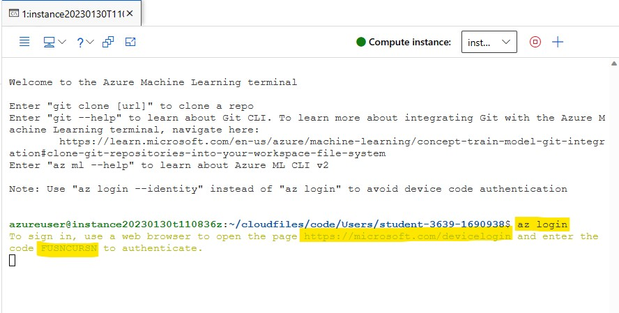

# Using an Azure Machine Learning job for automation
Azure Machine Learning is a cloud service for accelerating and managing the machine learning project lifecycle. Machine learning professionals, data scientists, and engineers can use it in their day-to-day workflows: Train and deploy models, and manage MLOps.

You can create a model in Azure Machine Learning or use a model built from an open-source platform, such as Pytorch, TensorFlow, or scikit-learn. MLOps tools help you monitor, retrain, and redeploy models.

## MLOps: DevOps for machine learning
DevOps for machine learning models, often called MLOps, is a process for developing models for production. A model's lifecycle from training to deployment must be auditable if not reproducible.

### ML model lifecycle
   
   
    
### Integrations enabling MLOPs
Azure Machine Learning is built with the model lifecycle in mind. You can audit the model lifecycle down to a specific commit and environment.

Some key features enabling MLOps include:

- git integration
- MLflow integration
- Machine learning pipeline scheduling
- Azure Event Grid integration for custom triggers
- Easy to use with CI/CD tools like GitHub Actions or Azure DevOps

Also, Azure Machine Learning includes features for monitoring and auditing:

- Job artifacts, such as code snapshots, logs, and other outputs
- Lineage between jobs and assets, such as containers, data, and compute resources

Machine learning operations (MLOps) applies DevOps principles to machine learning projects. In this lab, you'll learn how to implement key concepts like source control, automation, and CI/CD to build an end-to-end MLOps solution.


## Prerequisites
- Azure Subscription
- Azure Machine Learning workspace and Compute Instance to run notebooks

## Learning Objectives
- Create a Notebook that trains a model
- Convert the Notebook to Python scripts
- Define Azure Machine Learning Job
- Trigger Azure Machine Learning Job  


## Exercise 1: Create a Notebook that trains a Machine Learning model to predict quality of wine.
1. Go to the resource group deployed in the Azure Portal. Amongst the list of resources, open the Azure Machine Learning workspace.

    

2. Click on the **Launch Studio** Tile.

    

3. After landing on to the Azure ML Workspace. Your Home Page looks like below.

    

4. Now on the left side, Go to **Notebooks** and click on **⊕** and **Create new file**.

    

5. Give ```train-classification-model.ipynb``` as File name and Select **Notebook** as File type from Dropdown. Click **Create**.

    

6. Select **compute instance** starting with ```instance{*}``` that is already created for you. Click on **Start compute**, if the instance is in stopped state.

    

Before running the notebook, you need to upload **wine-quality-data.csv** file to your workspace. 
- Go to the resource group deployed in the Azure Portal. Amongst the list of resources, open the Storage account. On the left side, click on **Containers**. Then open **azureml** container. Inside you will see the **wine-quality-data.csv** file. On the right side, click on **...** and **Downlaod**. The csv file will be downloaded to your local system in **Downloads** folder.

    
    
    
    

- Now go back to the Azure ML workspace, Go to **Notebooks** and click on **⊕** and **Upload files**. Browse and select the csv file you downloaded. Click **Upload**. 

    
    
    

7. Now open the Notebook you created and Run the below scripts in the command cell. And use (+Code) icon for new cells.

   

Here you will read a CSV file and train a model to predict quality of wine.

### Read data from a CSV file
      
```python
import pandas as pd
df = pd.read_csv('wine-quality-data.csv')
df
```
      
### Split data

```python
# X will contain the data for 11 columns used for predicting.
X = df[['fixed acidity','volatile acidity','citric acid','residual sugar','chlorides','free sulfur dioxide','total sulfur     dioxide','density','pH','sulphates','alcohol']].values
# y is the target column i.e., it has wine quality with scores from 0 to 10.
y = df['quality']
```

```python
# train_test_split library is used to split our data into train and test sets.
from sklearn.model_selection import train_test_split
X_train, X_test, y_train, y_test = train_test_split(X, y, test_size=0.2, random_state=42)
```

### Train model

```python
#The random forest classifier is a supervised learning algorithm which you can use for regression and classification problems.
#n_estimators is the number of trees in the forest.
from sklearn.ensemble import RandomForestClassifier
rfc = RandomForestClassifier(n_estimators=200) 
rfc.fit(X_train, y_train)
```

### Evaluate model

```python
#The confusion_matrix function evaluates classification accuracy by computing the confusion matrix with each row corresponding to the true class.
#The classification_report function builds a text report showing the main classification metrics.
from sklearn.metrics import confusion_matrix, classification_report
pred_rfc = rfc.predict(X_test)
print(classification_report(y_test, pred_rfc))
print(confusion_matrix(y_test, pred_rfc))
```

```python
#The accuracy_score function computes the accuracy, either the fraction or the count of correct predictions.
from sklearn.metrics import accuracy_score
cm = accuracy_score(y_test, pred_rfc)
cm
```

### Test the model by giving new parameters

```python
df.head(10)
```
    
```python
Xnew = [[7.0,	0.27,	0.36,	20.7,	0.045,	45.0,	170.0,	1.0010,	3.00,	0.45,	8.8]]
ynew = rfc.predict(Xnew)
print('The quality of wine with given parameters is:') 
print(ynew)
```

## Exercise 2: Convert the Notebook to Python scripts
Though the Jupyter notebook is ideal for experimentation, it’s not a good fit for production workloads. Your next task will be to convert the notebooks to scripts and to run the model training as an Azure Machine Learning job, so that the workflow can easily be triggered and automated.

To make a machine learning model ready for production, you should first get your code ready for production. When you have a Jupyter notebook that needs to be converted to production code, you’ll need to:
- Clean nonessential code.
- Export your code to Python scripts.
- Use functions in your scripts.
- Use parameters in your scripts.

### Creating python script
1. Go to **Notebooks** and click on **⊕** and **Create new folder** and give ```src``` as Folder Name. Click **Create**.

    
    

2. Now when you hover on the folder **src**, you will see **...**  . Click on it and select **Create new file**.

    

3. Give ```main.py``` as File name and Select **Python** as File type from Dropdown. Click **Create**.

    

4. Select **compute instance** starting with ```instance{*}``` that is already created for you. Click on **Start compute**, if the instance is in stopped state.

    

Add the following snippets to the python script

```python
# Import libraries
import argparse
import glob
import os
import pandas as pd
from sklearn.model_selection import train_test_split
from sklearn.ensemble import RandomForestClassifier
import mlflow


def main(args):
    # enable autologging
    mlflow.autolog()

    # read data
    df = get_csvs_df(args.training_data)

    # split data
    X_train, X_test, y_train, y_test = split_data(df)

    # train model
    train_model(args.n_estimators, X_train, X_test, y_train, y_test)


# function to read CSV file
def get_csvs_df(path):
    if not os.path.exists(path):
        raise RuntimeError(f"Cannot use non-existent path provided: {path}")
    csv_files = glob.glob(f"{path}/*.csv")
    if not csv_files:
        raise RuntimeError(f"No CSV files found in provided data path: {path}")
    return pd.concat((pd.read_csv(f) for f in csv_files), sort=False)


# function to split data
def split_data(df):
    X = df[['fixed acidity', 'volatile acidity',
            'citric acid', 'residual sugar', 'chlorides',
            'free sulfur dioxide', 'total sulfur dioxide',
            'density', 'pH', 'sulphates', 'alcohol']].values
    y = df['quality']
    X_train, X_test, y_train, y_test = train_test_split(
        X, y, test_size=0.30, random_state=0)
    return X_train, X_test, y_train, y_test


# function to train model
def train_model(n_estimators, X_train, X_test, y_train, y_test):
    RandomForestClassifier(n_estimators=n_estimators).fit(X_train, y_train)


# function to read input arguments
def parse_args():
    # setup arg parser
    parser = argparse.ArgumentParser()

    # add arguments
    parser.add_argument("--training_data", dest='training_data',
                        type=str)
    parser.add_argument("--n_estimators", dest='n_estimators',
                        type=float, default=200)

    # parse args
    args = parser.parse_args()

    # return args
    return args


# run script
if __name__ == "__main__":

    # add space in logs
    print("\n\n")
    print("*" * 60)

    # parse args
    args = parse_args()

    # run main function
    main(args)

    # add space in logs
    print("*" * 60)
    print("\n\n")
```

By using functions in your scripts, it will be easier to test your code quality. When you have a script that you want to execute, you can use an Azure Machine Learning job to run the code.

## Exercise 3: Define Azure Machine Learning Job
To define a job in Azure Machine Learning, you can create a YAML file. Whether you want to run one script as a command job or multiple scripts sequentially as a pipeline. For both command and pipeline jobs, you'll need to create a YAML file, which details:
- Which scripts to run.
- What the inputs and outputs are for each script.
- The compute that will be used to run the scripts.
- The environment that needs to be installed on the compute to run the scripts.

### Creating YAML Job
1. Go to **Notebooks** and click on **⊕** and **Create new file**.

2. Give ```job.yaml``` as File name and Select **Yaml** as File type from Dropdown. Click **Create**.

    

3. Select **compute instance** starting with ```instance{*}``` that is already created for you. Click on **Start compute**, if the instance is in stopped state.

    
 
An example of a command job that uses a registered data asset as input when running the ```main.py``` script is shown in the following YAML. Paste it in the Yaml file you created.

```yaml
$schema: https://azuremlschemas.azureedge.net/latest/commandJob.schema.json
code: src
command: python main.py --training_data ${{inputs.training_data}}
inputs:
training_data: 
    path: <Registered-Data-Asset-Path>
    mode: ro_mount  
environment: azureml:AzureML-sklearn-0.24-ubuntu18.04-py37-cpu@latest
compute: azureml:<Compute-instance-name>
experiment_name: wine-quality-data-example
description: Train a classification model on wine quality data using a registered dataset as input.
```

In the YAML file, you'll find the necessary details you need to include:
   - The ```code``` refers to the local folder, which stores the scripts you want to run. The ```command``` key specifies that the ```main.py``` script in the ```src``` folder should be executed, using the value of ```inputs.training_data``` for the ```training_data``` parameter.
   - ```<Registered-Data-Asset-Path>``` is the path of registered data asset ```wine-quality-data.csv``` in the Azure Machine Learning workspace is mounted to the compute to be used as input for the script.
   - The compute instance ```<Compute-instance-name>``` will be used to run the scripts.
   - The latest version of the registered custom sklearn environment will be installed on the compute instance before running the script.

To get ```<Registered-Data-Asset-Path>``` field value, First you need to create a Data Asset:

- Now on the left side, Go to **Data**, select **Datastores** and open **workspaceartifactstore**.

    

- Under Browse Preview, you will see the **wine-quality-data.csv** file. Click on it.

    

- Now you can preview the csv file data. On the right side, click on **Create as data asset**.

    

- Now give ```wine-quality``` as Name and let other fields be default. Click **Create**.

    

- Now Go to **Data**, select **Data assets** and you will see the data asset you created. Open it.

    

- Now under **Attributes**, Copy the URI path under field **Named asset URI**. And paste in ```<Registered-Data-Asset-Path>``` field in the ```job.yaml``` file.

    

For ```<Compute-instance-name>```, go to **compute**, under **Compute instances**, copy-paste the name of the instance.

   

To test the YAML definition of the job, you can trigger it using the CLI v2.

## Exercise 4: Trigger Azure Machine Learning Job
Whenever you want to run an Azure Machine Learning job, you can use the CLI v2. The CLI v2 can be installed on your local device, or you can use the Azure Cloud Shell available on Azure Machine Learning Workspace.
1. Click on **Open terminal** under Notebooks.

    

2. First login to your azure account using the below command.
    
```cmd
az login
```
    
   

3. Now, you can submit an Azure Machine Learning job using the following command:

```cmd
az ml job create --file job.yaml
```
    
   

4. On the left side, Goto **Jobs** and select **All jobs**. Here you can see all the jobs that you had run.

    

5. Click on the **Job Display Name** to view more details.

    


[Next Module ⏭️](../2_triggering-azure-machine-learning-jobs-with-github-actions/documentation.md)
