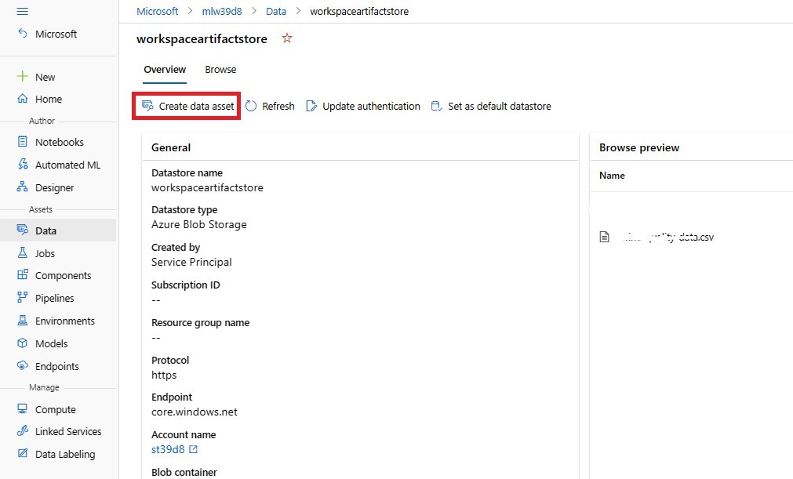

# Using an Azure Machine Learning job for automation

Azure Machine Learning is a cloud service for accelerating and managing the machine learning project lifecycle. Machine learning professionals, data scientists, and engineers can use it in their day-to-day workflows: Train and deploy models, and manage MLOps.

You can create a model in Azure Machine Learning or use a model built from an open-source platform, such as Pytorch, TensorFlow, or scikit-learn. MLOps tools help you monitor, retrain, and redeploy models.

## MLOps: DevOps for machine learning

DevOps for machine learning models, often called MLOps, is a process for developing models for production. A model's lifecycle from training to deployment must be auditable if not reproducible.

### ML model lifecycle
   
   
    
### Integrations enabling MLOPs

Azure Machine Learning is built with the model lifecycle in mind. You can audit the model lifecycle down to a specific commit and environment.

Some key features enabling MLOps include:

- git integration
- MLflow integration
- Machine learning pipeline scheduling
- Azure Event Grid integration for custom triggers
- Easy to use with CI/CD tools like GitHub Actions or Azure DevOps

Also, Azure Machine Learning includes features for monitoring and auditing:

- Job artifacts, such as code snapshots, logs, and other outputs
- Lineage between jobs and assets, such as containers, data, and compute resources

Machine learning operations (MLOps) applies DevOps principles to machine learning projects. In this lab, you'll learn how to implement key concepts like source control, automation, and CI/CD to build an end-to-end MLOps solution.

## Prerequisites

- Azure Subscription
- Azure Machine Learning workspace and Compute Instance to run notebooks

## Learning Objectives

- Create a Notebook that trains a model
- Convert the Notebook to Python script
- Define Azure Machine Learning Job
- Trigger Azure Machine Learning Job  


## Exercise 1: Create a Notebook that trains a Machine Learning model to predict quality of wine.

1. Go to the resource group deployed in the Azure Portal. Amongst the list of resources, open the Azure Machine Learning workspace.

    

2. Click on the **Launch Studio** Tile.

    

3. After landing on to the Azure ML Workspace. Your Home Page looks like below.

    

4. Now on the left side, Go to **Notebooks** and click on **⊕** and **Create new file**.

    

5. Give ```main.ipynb``` as File name and Select **Notebook** as File type from Dropdown. Click **Create**.

    

6. Select **compute instance** starting with ```instance{*}``` that is already created for you. Click on **Start compute**, if the instance is in stopped state. Choose Python 3.8 - AzureML (from drop down kernal list)

    

Before running the notebook, you need to upload **nyc-taxi-data.csv** file to your workspace.

7. Go to the resource group deployed in the Azure Portal. Amongst the list of resources, open the Storage account. On the left side, click on **Containers**. Then open **azureml** container. Inside you will see the **nyc-taxi-data.csv** file. On the right side, click on **...** and **Downlaod**. The csv file will be downloaded to your local system in **Downloads** folder.

    
    
    
    
    
    
8. Now go back to the Azure ML workspace, Go to **Notebooks** and click on **⊕** and **Upload files**. Browse and select the csv file you downloaded. Click **Upload**. 

    
    
    
    
    

9. Now open the Notebook you created and Run all the below scripts in the command cell. And use (+Code) icon for new cells.

   

Here you use Azure Machine Learning service to create a regression model to predict NYC taxi fare prices.

### Import Libraries

Import all the libraries we require to process the data and train the model.
      
```python
import pandas as pd
from sklearn.model_selection import train_test_split
from sklearn.linear_model import LinearRegression
from sklearn.metrics import mean_squared_error
from math import sqrt
```

### Download and Prepare data

Begin by creating a dataframe to hold the taxi data. Then preview the data.

```python
df = pd.read_csv('nyc-taxi-data.csv') 
df.head(10)
```

### Cleanse data

You will use only the columns that you need for training. You will hold those columns in another dataframe.

```python
taxi_df = df[['vendorID','passengerCount','tripDistance','pickupLongitude','pickupLatitude','dropoffLongitude','dropoffLatitude','totalAmount']]
```

Run the ```describe()``` function on the new dataframe to see summary statistics for each field.

```python
taxi_df.describe()
```

From the summary statistics, you see that there are several fields that have outliers or values that will reduce model accuracy. First filter the latitude/longitude fields to be within the bounds of the Manhattan area. This will filter out longer taxi trips or trips that are outliers in respect to their relationship with other features.

Additionally filter the ```tripDistance``` field to be greater than zero but less than 31 miles (the haversine distance between the two latitude/longitude pairs). This eliminates long outlier trips that have inconsistent trip cost.

Lastly, the ```totalAmount``` field has negative values for the taxi fares, which don't make sense in the context of our model, and the ```passengerCount``` field has bad data with the minimum values being zero.

Filter out these anomalies using query functions

```python
final_df = taxi_df.query("pickupLatitude>=40.53 and pickupLatitude<=40.88")
final_df = final_df.query("pickupLongitude>=-74.09 and pickupLongitude<=-73.72")
final_df = final_df.query("tripDistance>=0.25 and tripDistance<31")
final_df = final_df.query("passengerCount>0 and totalAmount>0")
```

Now since you have filtered out latitude/longitude, you don't require those columns for training.

```python
columns_to_remove_for_training = ["pickupLongitude", "pickupLatitude", "dropoffLongitude", "dropoffLatitude"]
for col in columns_to_remove_for_training:
    final_df.pop(col)
```

Call describe() again on the data to ensure cleansing worked as expected. You now have a prepared and cleansed set of taxi data to use for machine learning model training.

```python
final_df.describe()
```
### Split the data into train and test sets

Split the data into training and test sets by using the ```train_test_split``` function in the ```scikit-learn``` library. This function segregates the data into the x (**features**) data set for model training and the y (**values to predict**) data set for testing. The ```test_size``` parameter determines the percentage of data to allocate to testing. The ```random_state``` parameter sets a seed to the random generator, so that your train-test splits are deterministic.

```python
# X will hold the data set for model training.
X = final_df.drop(["totalAmount"], axis=1)
# y is the target column i.e., values to predict.
y = final_df["totalAmount"]

X_train, X_test, y_train, y_test = train_test_split(X, y, test_size=0.2, random_state=223)
```

The purpose of this step is to have data points to test the finished model that haven't been used to train the model, in order to measure true accuracy.

In other words, a well-trained model should be able to accurately make predictions from data it hasn't already seen.

### Train the regression model

```Linear Regression``` is a machine learning algorithm based on supervised learning. It performs a regression task. Regression models a target prediction value based on independent variables. It is mostly used for finding out the relationship between variables and forecasting.

```python
model=LinearRegression()
model.fit(X_train, y_train)
```

### Test the model accuracy

Use the model to run predictions on the test data set to predict taxi fares. The function ```predict``` uses the model and predicts the values of y, **trip cost**, from the X_test data set.

```python
y_predict = model.predict(X_test)
```

Calculate the ```root mean squared error``` of the results. Convert the y_test dataframe to a list to compare to the predicted values. The function mean_squared_error takes two arrays of values and calculates the average squared error between them. Taking the square root of the result gives an error in the same units as the y variable, cost. It indicates roughly how far the taxi fare predictions are from the actual fares.

```python
y_actual = y_test.values.flatten().tolist()
rmse = sqrt(mean_squared_error(y_actual, y_predict))
rmse
```

Run the following code to calculate mean absolute percent error (MAPE) by using the full y_actual and y_predict data sets. This metric calculates an absolute difference between each predicted and actual value and sums all the differences. Then it expresses that sum as a percent of the total of the actual values.


```python
sum_actuals = sum_errors = 0

for actual_val, predict_val in zip(y_actual, y_predict):
    abs_error = actual_val - predict_val
    if abs_error < 0:
        abs_error = abs_error * -1

    sum_errors = sum_errors + abs_error
    sum_actuals = sum_actuals + actual_val

mean_abs_percent_error = sum_errors / sum_actuals
print("Model MAPE:")
print(mean_abs_percent_error)
print()
print("Model Accuracy:")
print(1 - mean_abs_percent_error)
```

From the two prediction accuracy metrics, you see that the model is fairly good at predicting taxi fares from the data set's features, typically within +- $4.00, and approximately 15% error.

## Exercise 2: Convert the Notebook to Python script

Though the Jupyter notebook is ideal for experimentation, it’s not a good fit for production workloads. Your next task will be to convert the notebooks to scripts and to run the model training as an Azure Machine Learning job, so that the workflow can easily be triggered and automated.

To make a machine learning model ready for production, you should first get your code ready for production. When you have a Jupyter notebook that needs to be converted to production code, you’ll need to:
- Clean nonessential code.
- Export your code to Python scripts.
- Use functions in your scripts.
- Use parameters in your scripts.

### Creating python script 

You will use code snippets from the notebook and create different functions for reading csv, cleansing data, splitting data, trainining model to make it production ready.

> You can convert the notebook into python script by running the command ```jupyter nbconvert --to python main.ipynb``` in terminal.

1. Go to **Notebooks** and click on **⊕** and **Create new folder** and give ```src``` as Folder Name. Click **Create**.

    
    
    

2. Now when you hover on the folder **src**, you will see **...**  . Click on it and select **Create new file**.

    

3. Give ```main.py``` as File name and Select **Python** as File type from Dropdown. Click **Create**.

    

4. Select **compute instance** starting with ```instance{*}``` that is already created for you. Click on **Start compute**, if the instance is in stopped state.

    

Go throught the following code and add it to the python script ```main.py```.

```python
import os
import glob
import argparse
import pandas as pd
from sklearn.model_selection import train_test_split
from sklearn.linear_model import LinearRegression
import mlflow

# define functions
def main(args):
    # enable auto logging
    mlflow.autolog()

    # read in data
    df = get_csvs_df(args.training_data)

    # Cleanse data
    final_df = cleanse_data(df)

    # split data
    X_train, X_test, y_train, y_test = split_data(final_df)

    # train model
    model = train_model(X_train, X_test, y_train, y_test)

def get_csvs_df(path):
    if not os.path.exists(path):
        raise RuntimeError(f"Cannot use non-existent path provided: {path}")
    csv_files = glob.glob(f"{path}/*.csv")
    if not csv_files:
        raise RuntimeError(f"No CSV files found in provided data path: {path}")
    return pd.concat((pd.read_csv(f) for f in csv_files), sort=False)   

def cleanse_data(df):
    taxi_df = df[['vendorID','passengerCount','tripDistance','pickupLongitude','pickupLatitude','dropoffLongitude','dropoffLatitude','totalAmount']]
    final_df = taxi_df.query("pickupLatitude>=40.53 and pickupLatitude<=40.88")
    final_df = final_df.query("pickupLongitude>=-74.09 and pickupLongitude<=-73.72")
    final_df = final_df.query("tripDistance>=0.25 and tripDistance<31")
    final_df = final_df.query("passengerCount>0 and totalAmount>0")
    columns_to_remove_for_training = ["pickupLongitude", "pickupLatitude", "dropoffLongitude", "dropoffLatitude"]
    for col in columns_to_remove_for_training:
        final_df.pop(col)
    return final_df

def split_data(final_df):
    X = final_df.drop(["totalAmount"], axis=1)
    y = final_df["totalAmount"]
    X_train, X_test, y_train, y_test = train_test_split(X, y, test_size=0.2, random_state=223)
    return X_train, X_test, y_train, y_test

def train_model(X_train, X_test, y_train, y_test):
    model=LinearRegression()
    model.fit(X_train, y_train)

def parse_args():
    parser = argparse.ArgumentParser()
    parser.add_argument("--training_data", dest='training_data',
                        type=str)
    args = parser.parse_args()
    return args

if __name__ == "__main__":

    # add space in logs
    print("\n\n")
    print("*" * 60)

    # parse args
    args = parse_args()

    # run main function
    main(args)

    # add space in logs
    print("*" * 60)
    print("\n\n")
```

By using functions in your scripts, it will be easier to test your code quality. When you have a script that you want to execute, you can use an Azure Machine Learning job to run the code.

## Exercise 3: Define Azure Machine Learning Job

To define a job in Azure Machine Learning, you can create a YAML file. Whether you want to run one script as a command job or multiple scripts sequentially as a pipeline. For both command and pipeline jobs, you'll need to create a YAML file, which details:
- Which scripts to run.
- What the inputs and outputs are for each script.
- The compute that will be used to run the scripts.
- The environment that needs to be installed on the compute to run the scripts.

### Creating YAML Job

1. Go to **Notebooks** and click on **⊕** and **Create new file**.

2. Give ```job.yaml``` as File name and Select **Yaml** as File type from Dropdown. Click **Create**.

    

3. Select **compute instance** starting with ```instance{*}``` that is already created for you. Click on **Start compute**, if the instance is in stopped state.

    
 
An example of a command job that uses a registered data asset as input when running the ```main.py``` script is shown in the following YAML. Paste it in the Yaml file you created.

```yaml
$schema: https://azuremlschemas.azureedge.net/latest/commandJob.schema.json
code: src
command: >-
  python main.py 
  --training_data ${{inputs.training_data}}
inputs:
  training_data: 
    path: <Registered-Data-Asset-Path>
    mode: ro_mount  
environment: azureml:AzureML-sklearn-0.24-ubuntu18.04-py37-cpu@latest
compute: <Compute-instance-name>
experiment_name: NYC Taxi Fare Prices
description: Train a classification model on nyc taxi data to predict taxi fare prices.
```
In the YAML file, you'll find the necessary details you need to include:
   
   - The ```code``` refers to the local folder, which stores the scripts you want to run. The ```command``` key specifies that the ```main.py``` script in the ```src``` folder should be executed, using the value of ```inputs.training_data``` for the ```training_data``` parameter.
   - ```<Registered-Data-Asset-Path>``` is the path of registered data asset ```nyc-taxi-data.csv``` in the Azure Machine Learning workspace is mounted to the compute to be used as input for the script.
   - The compute instance ```<Compute-instance-name>``` will be used to run the scripts.
   - The latest version of the registered custom sklearn environment will be installed on the compute instance before running the script.

To get ```<Registered-Data-Asset-Path>``` field value, First you need to create a Data Asset:

- Now on the left side, Go to **Data**, select **Datastores** and open **workspaceartifactstore**.

    

- Under **Overview**, you will see the **Create data asset**.

    

- Now give ```nyc-taxi-data``` as **Name** and select ```Folder(uri folder)``` as **Type** from dropdown. Click on **Next**.

    

- Under **Choose a storage path**, select **Enter storage path manually** and give ```/``` as **Storage path**. Click **Next**.

    
    
- Review and Select **Create**.

    

- Now Go to **Data**, select **Data assets** and you will see the data asset you created. Open it.

    

- Now under **Attributes**, Copy the URI path under field **Named asset URI**. And paste in ```<Registered-Data-Asset-Path>``` field in the ```job.yaml``` file.

    

For ```<Compute-instance-name>```, go to **compute**, under **Compute instances**, copy-paste the name of the instance.
    

To test the YAML definition of the job, you can trigger it using the CLI v2.

## Exercise 4: Trigger Azure Machine Learning Job

Whenever you want to run an Azure Machine Learning job, you can use the CLI v2. The CLI v2 can be installed on your local device, or you can use the Azure Cloud Shell available on Azure Machine Learning Workspace.

1. Click on **Open terminal** under Notebooks.

    

2. First login to your azure account using the below command.

    

```cmd
az login
```

3. Now, you can submit an Azure Machine Learning job using the following command:

    

```cmd
az ml job create --file job.yaml
```

4. On the left side, Goto **Jobs** and select **All jobs**. Here you can see all the jobs that you had run.

    

5. Click on the **Job Display Name** to view more details.

    


[Next Module ⏭️](../2_triggering-azure-machine-learning-jobs-with-github-actions/documentation.md)
