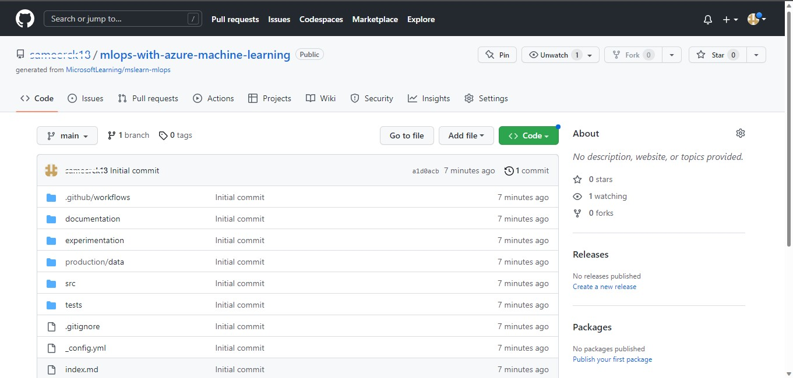

# Triggering Azure Machine Learning jobs with GitHub Actions


## Prerequisites
- Azure Subscription
- Azure Machine Learning workspace and Compute Cluster

## Learning Objectives
- Create a GitHub Repository
- Create a service principal needed to run an Azure Machine Learning job
- Store Azure credentials securely using secrets in GitHub
- Create a GitHub Action using YAML that uses the stored Azure credentials to run an Azure Machine Learning job

## Exercise 1: Create a GitHub Account and Repository
1. Browse to [GitHub](https://github.com). If you already have an account click on **"Sign in"** and open your GitHub Account. If you don't have an account then click on **"Sign up"** at the top-right corner.


2. Enter your email address, create a password and give a unique username for your GitHub Account. Click **continue.**


4. verify your account by solving a puzzle and click on **create account.**
5. Next you will receive a GitHub Launch Code to your email address. Enter the code and your GitHub account is ready.


6. Create a new public repo by navigating to https://github.com/MicrosoftLearning/mslearn-mlops and selecting the **Use this template** button to create your own repo.


7. Select **Owner**(Username of your GitHub Account) and **Repository Name** as ```mlops-with-azure-machine-learning```.


8. You'll see this page once repo is created in your GitHub Account.



[ ⏮️ Previous Module](../1_using-an-azure-machine-learning-job-for-automation/documentation.md) - [Next Module ⏭️ ](../3_triggering-github-actions-with-trunk-based-development/documentation.md)
