# Working with linting and unit testing in GitHub Actions

You can verify your code used by Azure Machine Learning to train models automatically with GitHub Actions. Whenever you create your own machine learning models, you're likely to work with scripts to automate machine learning tasks.

You may want the scripts to adhere to your organization's quality standards. By enforcing programmatic or stylistic guidelines for your code, it's easier for data scientists to read each other's scripts.

Before moving code to production, you'll also want to check the performance of the scripts to ensure they work as expected.

Only when you've verified the code quality do you want to use the code in production. You can use GitHub Actions to automatically check the code whenever a pull request is created.

To verify the code used to train the nyc taxi fare price model, you'll want to run:

- **Linting**: Checking for programmatic or stylistic errors in Python scripts.
- **Unit testing**: Checking for the performance of the contents of the code.

To help the data science team understand the code quality standards, they'll be able to verify their code when developing locally in Visual Studio Code.

However, you want to automate the code verification to check that all code pushed to production has no issues and works as expected. Together with the data science team, you decide to run linting and unit testing whenever a pull request is created by using GitHub Actions workflow.

Let's explore the workflow:

- The production code is hosted in the **main** branch.
- A data scientist creates a **feature branch** for model development.
- The data scientist creates a **pull request** to propose to push changes to the main branch.
- When a pull request is created, a **GitHub Actions workflow** is triggered to verify the code.
- When the code passes **linting** and **unit testing**, the lead data scientist needs to approve the proposed changes.
- After the lead data scientist approves the changes, the pull request is **merged**, and the main branch is updated accordingly.

You'll need to create a GitHub Actions workflow that verifies the code by running a linter and unit tests whenever a pull request is created.

## Prerequisites

- Azure Subscription
- GitHub Account

## Learning objectives

- Run linters and unit tests with GitHub Actions.
- Integrate code checks with pull requests.

## Exercise 1: Run linters and unit tests with GitHub Actions

There are two common types of checks you'll want to do on your code: **linters** and **unit tests**.

You can use **linters** to check whether your code adheres to quality guidelines your organization has set. For example, to lint your code with Flake8, you'll create a ```.flake8``` configuration file, which contains the rules your code has to adhere to.

To check whether the code works as expected, you can create **unit tests**. To easily test specific parts of your code, your scripts should contain functions. You can test functions in your scripts by creating test files. A popular tool to test Python code is **Pytest**.

### Lint your code

The quality of your code depends on the standards you and your team agree on. To ensure that the agreed upon quality is met, you can run linters that will check whether the code conforms to the standards of the team.

Depending on the code language you use, there are several options to lint your code. For example, if you work with Python, you can use either Flake8 or Pylint.

#### Lint with GitHub Actions

You can run the linter automatically with GitHub Actions. The agent provided by platform will run the linter when you:

- Create a configuration file ```.flake8``` and store the file in your repo.
- Define the continuous integration workflow in YAML.
- As a task or step, install Flake8 with ```python -m pip install flake8```.
- As a task or step, run the ```flake8``` command to lint your code.

The ```.flake8``` file should start with ```[flake8]```, followed by any of the configurations you want to use.

For example, if you want to specify that the maximum length of any line can't be more than 80 characters, you'll add the following line to your .flake8 file:

```
[flake8]
max-line-length = 80
```

Flake8 has a predefined list of errors it can return. You can choose to either select (```select```) a set of error codes that will be part of the linter or select which error codes to ignore (```ignore```) from the default list of options.

As a result, your ```.flake8``` configuration file may look like the following example:

```
[flake8]
ignore = 
    W504,
    C901,
    E41
max-line-length = 79
exclude = 
    .git,
    .cache,
max-complexity = 10
import-order-style = pep8
```

Create a new directory/folder in your github account repo with the name ```tests```. And create ```.flake8``` configuration file inside with above code copied. Click commit to save the file.

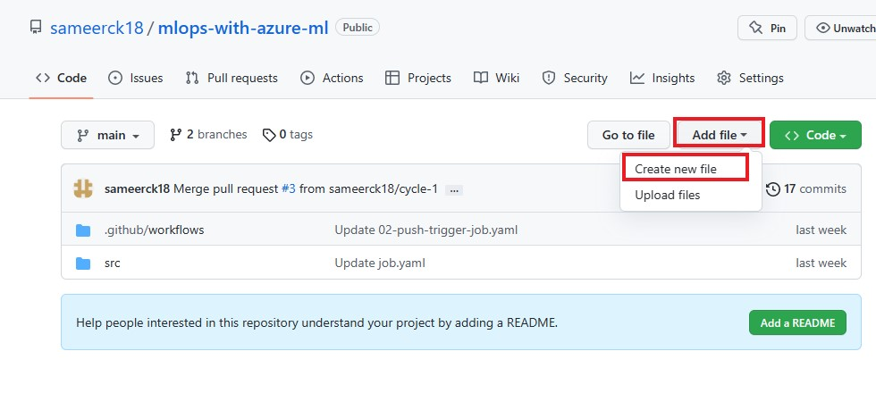

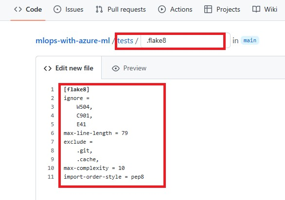
    

### Unit tests

Where linting verifies how you wrote the code, unit tests check how your code works. Units refer to the code you create. Unit testing is therefore also known as code testing.

As a best practice, your code should exist mostly out of functions. Whether you've created functions to prepare data, or to train a model. You can apply unit testing to, for example:

- Check that column names are right.
- Check the prediction level of model on new datasets.
- Check the distribution of prediction levels.

When you work with Python, you can use Pytest and Numpy (which uses the Pytest framework) to test your code.

You created a training script ```main.py```, in lab step 3 **Using an Azure Machine Learning Job for Automation**, which contains the following function:

```python
#function to read CSV file
def get_csvs_df(path):
    if not os.path.exists(path):
        raise RuntimeError(f"Cannot use non-existent path provided: {path}")
    csv_files = glob.glob(f"{path}/*.csv")
    if not csv_files:
        raise RuntimeError(f"No CSV files found in provided data path: {path}")
    return pd.concat((pd.read_csv(f) for f in csv_files), sort=False)
```

Assume you stored the training script in the directory ```src/model/main.py``` within your repo. To test the ```get_csvs_df``` function, you must import the function from ```src.model.main```.

You create the ```test_main.py``` file in the ```tests``` folder in git repo with the following code:

```python
import sys
sys.path.append('src/model')
import main
from main import get_csvs_df
import os
import pytest


def test_csvs_no_files():
    with pytest.raises(RuntimeError) as error:
        get_csvs_df("./")
    assert error.match("No CSV files found in provided data")


def test_csvs_no_files_invalid_path():
    with pytest.raises(RuntimeError) as error:
        get_csvs_df("/invalid/path/does/not/exist/")
    assert error.match("Cannot use non-existent path provided")


def test_csvs_creates_dataframe():
    current_directory = os.path.dirname(os.path.abspath(__file__))
    datasets_directory = os.path.join(current_directory, 'datasets')
    result = get_csvs_df(datasets_directory)
    assert len(result) == 20
```
For example, to test the ```get_csvs_df``` function, you can create a ```datasets``` folder inside ```tests``` containing some sample csv files. You will test the function by giving different paths.

#### Creating ```test_main.py```:

Go to your github repo ```tests``` folder. Select Add file > Create new file and give ```test_main.py``` as name and paste the above code.

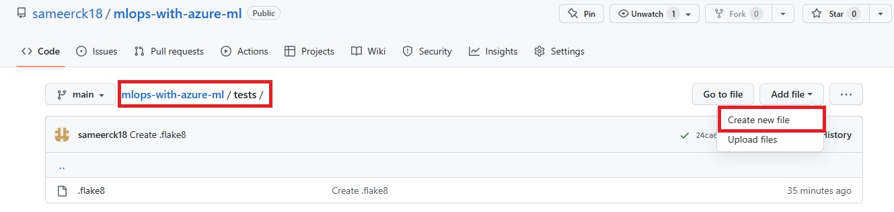
   
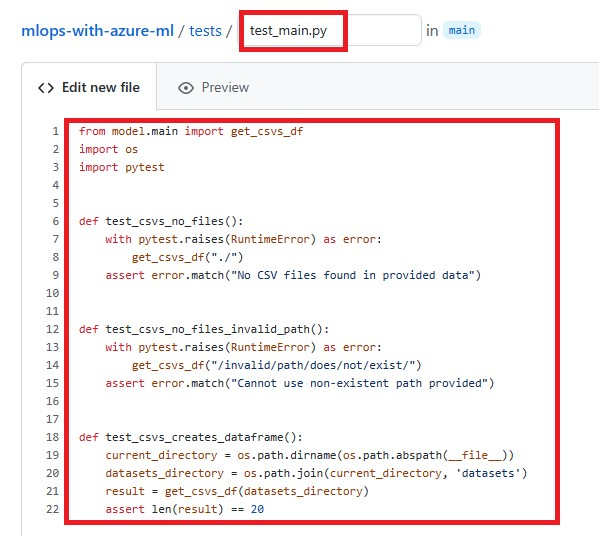
    
#### Creating datasets folder with csv files.

- Go to your github repo ```tests``` folder. Select Add file > Create new file and give ```datasets``` as name and give a slash(```/```). Then give ```first.csv```. Paste the following sample data for unit testing. Click commit. 

```
index,first,last
0,Glenn,Hernandez
1,Sarah,Pedersen
2,Jill,Tracy
3,Melissa,Nelson
4,Hugh,Soto
5,Frank,Dees
6,Vita,Singleton
7,James,Papenfuss
8,Mary,Smithson
9,Bonnie,Begor
```

   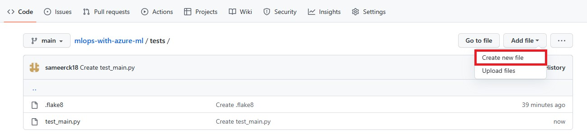
   
   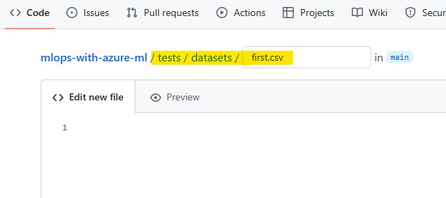

- Now go inside ```datasets``` folder, Select Add file > Create new file and give ```second.csv``` as name and Paste the following sample data for unit testing. Click commit.

```
index,first,last
0,Tina,Holloway
1,Katherine,Logan
2,Juan,Duncan
3,Doyle,Clyne
4,Jacob,Kazin
5,Kimberly,Tomes
6,Lisa,Cochrane
7,Troy,Hall
8,Erin,Johnson
9,Joan,Laborde
```

   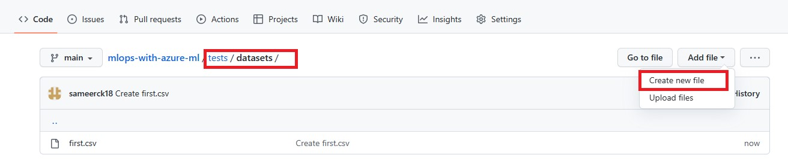
   
   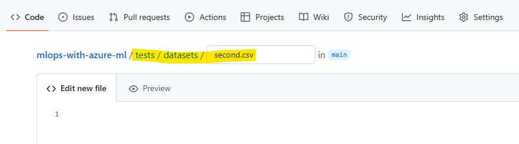
   
#### Creating requirements.txt

Go to your github repo. Select Add file > Create new file and give ```requirements.txt``` as name and paste the following snippet and commit.

```
pytest==7.1.2
mlflow==1.27.0
pandas==1.4.3
sklearn==0.0
scikit-learn==1.1.1
```

   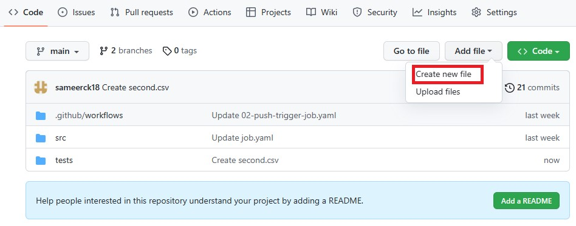
   
   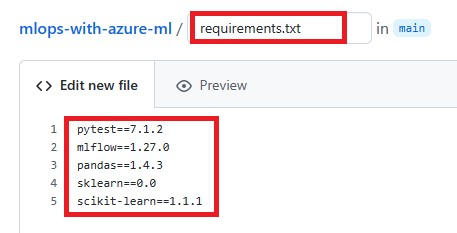
    

To run the test in GitHub Action:

- Ensure all necessary libraries are installed to run the training script. Ideally, use a ```requirements.txt``` listing all libraries with ```pip install -r requirements.txt```
- Install ```pytest``` with ```pip install pytest```
- Run the tests with ```pytest tests/```
- The results of the tests will show in the output of the workflow you run.


### Defining the workflow

Go to your github repo. Inside ```.github/workflows```, select Add file > Create new file and give ```03_code_checks.yaml``` as name and paste the following code and commit.

   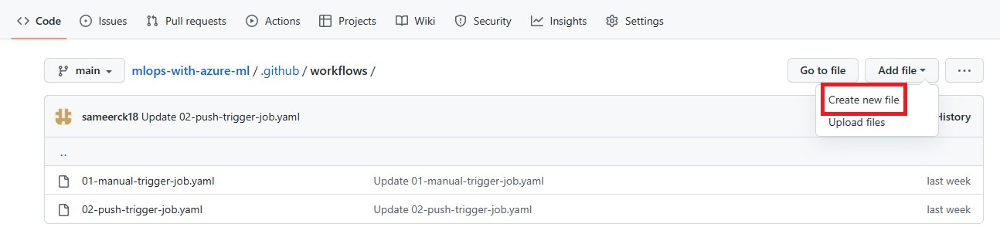
   
   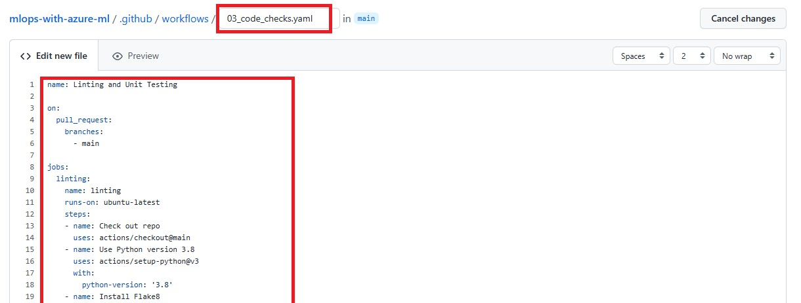

```yaml
name: Linting and Unit Testing

on: 
  workflow_dispatch:

jobs:
  job1:
    name: linting
    runs-on: ubuntu-latest
    steps:
    - name: Check out repo
      uses: actions/checkout@main
    - name: Use Python version 3.8
      uses: actions/setup-python@v3
      with:
        python-version: '3.8'
    - name: Install Flake8
      run: |
        python -m pip install flake8
    - name: Run linting tests
      run: | 
        flake8 src/model/
  unittest:
    runs-on: ubuntu-latest
    steps:
    - name: Check out repo
      uses: actions/checkout@main
    - name: Install az ml extension
      run: az extension add -n ml -y
    - name: Install requirements.txt
      run : pip install -r requirements.txt
    - name: Unit testing
      run: pytest tests/
```
  
### Triggering workflow manually

- Go to the **Actions** tab in your GitHub repo and Click on ```Linting and Unit Testing``` workflow and click on **Run workflow**. Inspect the output and fix your code where necessary.

    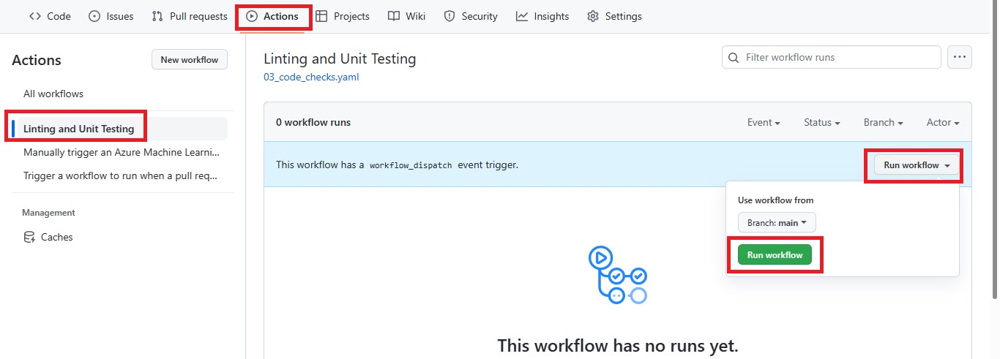
    
    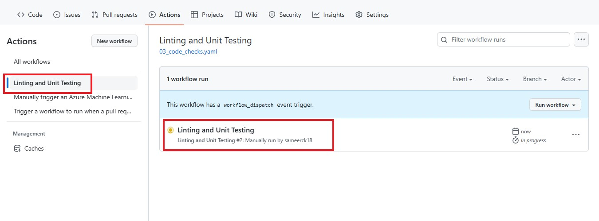
    
    


## Exercise 2: Integrate code checks with pull requests

To trigger a GitHub Actions workflow when a pull request is created, you can use ```on: pull_request```.

You want to ensure that a pull request may only be merged when all quality checks have passed.

To integrate the code checks with any pull requests that target the main branch, you'll need to do:

- Navigate to the **Settings** tab in your repo. Select **Branches**. Select **edit**. 

    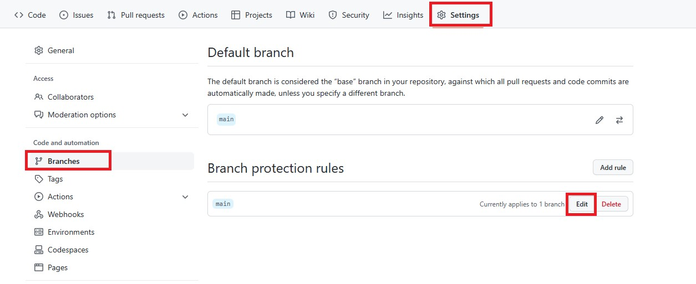
    
- Enable **Require status checks to pass before merging** within the branch protection rule for the main branch. 
- Here, you can search for ```linting``` and ```unittest``` and select your linters and unit tests to set them as required. Whenever you then create a pull request, you'll notice that it will trigger your GitHub Actions and only when the workflows pass successfully will you be able to merge the pull request. Select them. Click **Save changes**.

    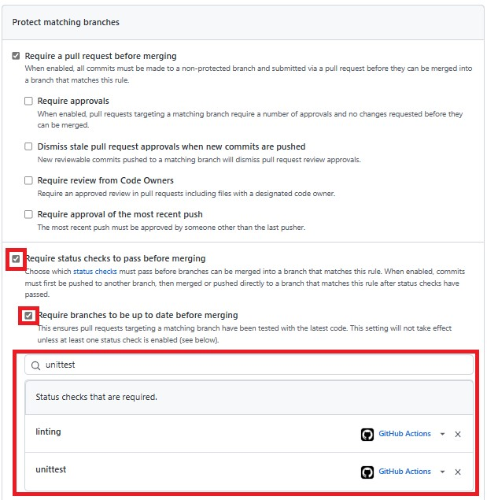

- Create a new branch with the name ```cycle-2```

    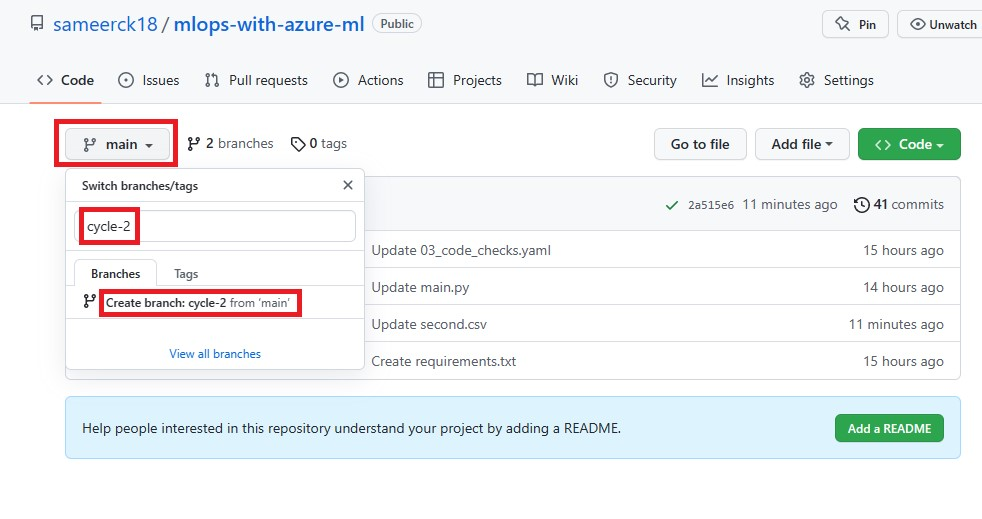

- Go to ```.github/workflows/03_code_checks.yaml``` in ```cycle-2``` branch and Click on ✏️ to edit the file.

    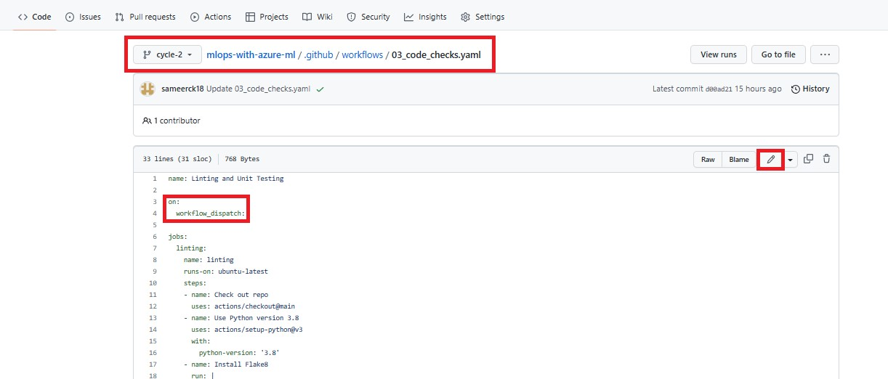
    
- Replace ```on: workflow_dispatch``` with:

    ```yaml
    on: 
      pull_request:
        branches:
          - main
    ```
    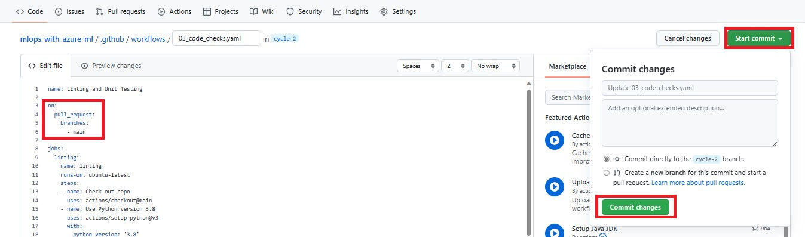

- Select **Start commit** and **Commit changes**.

#### Creating pull request

- Navigate to the **Pull requests** tab in your repo. Select **New pull request** and select ```base:main``` and ```compare:cycle-2```. Click **Create pull request**.

    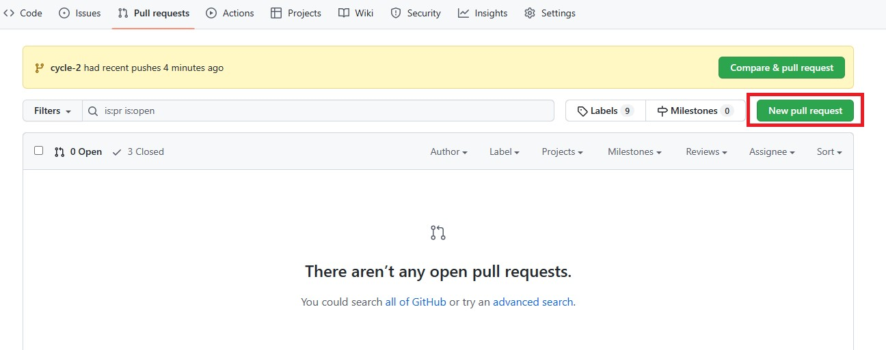
    
    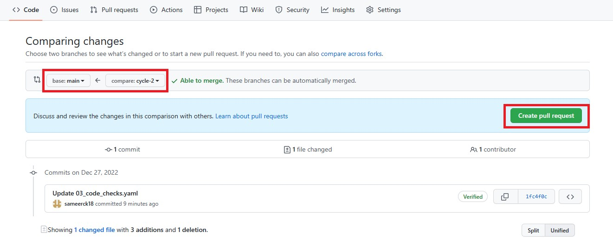
    
    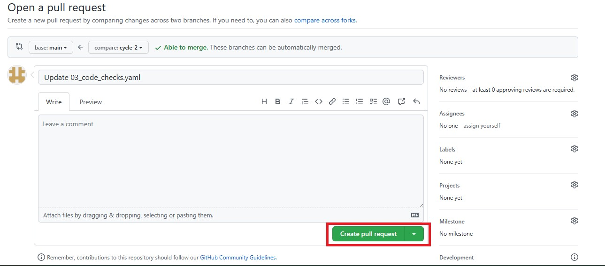

- In the next page, you will see two checks(```linting``` and ```unittest```) required to pass successfully before merging.

    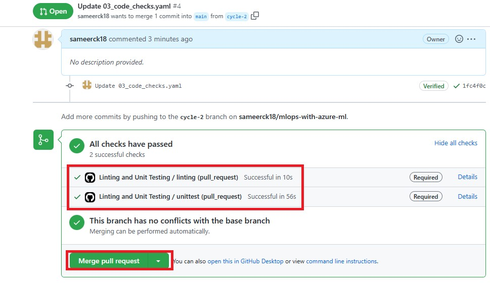

- Select **Merge pull request** and **Confirm merge** to merge.

    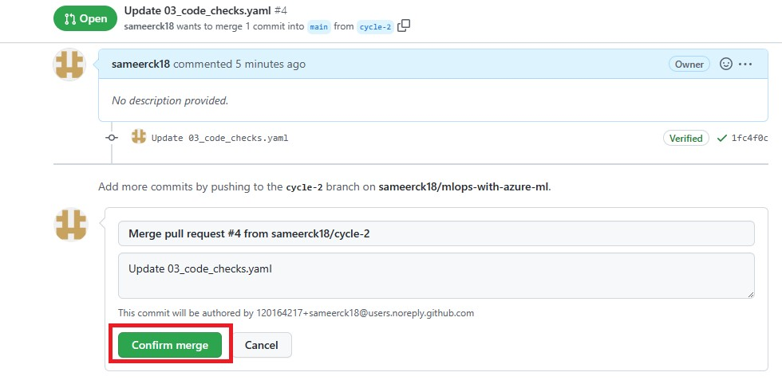


