# Working with environments in GitHub Actions

Imagine you're a machine learning engineer, tasked with taking a model from development to production. To train, test, and deploy a machine learning model it's best to use environments as part of your machine learning operations (MLOps) strategy.

After a data scientist has trained and tested the model, you'll want to deploy the model, test the deployment, and finally deploy the model to production where it will be consumed at a large scale. In line with software development practices, these tasks should be performed in different environments. By using environments like a development, staging, and production environment, you can separate the MLOps workflow.

To create different environments, you can create different Azure Machine Learning workspaces that are linked to separate GitHub environments. By using GitHub Actions, you can automate workflows across environments, adding gated approvals to mitigate risks.

> **Note: Though it’s a best practice to associate a separate Azure Machine Learning workspace to each separate environment, you can use one workspace for both the development and production environment for this challenge (to avoid extra costs).**

To work with environments, you'll want to:

- Create environments in your GitHub repository.
- Store credentials to each Azure Machine Learning workspace as an environment secret in GitHub.
- Add required reviewers to environments for gated approval.
- Use environments in your GitHub Actions workflows.

## Prerequisites

- Azure Subscription
- GitHub Account
- Azure ML workspace

## Learning objectives

- Set up environments in GitHub.
- Use environments in GitHub Actions.
- Add approvals to assign required reviewers before moving the model to the next environment.

## Exercise 1: Set up environments in GitHub

To implement environments when working with machine learning models, you can use a platform like GitHub. To automate tasks that need to run in separate environments, you'll need to:

- Set up the environments in GitHub: You can create secrets for each environments if you're using different Azure ML workspaces for development and production. But since we are using only one workspace, we will use same secret we created in ```step 2```.
- Use the environments in GitHub Actions.
- Add approvals to assign required reviewers.

To create an environment within your GitHub repo:

#### 1. Setup Development environment

Go to the **Settings** tab within your repo. Select **Environments**. Create a **new environment**. Enter a name (For ex- ```development environment```). Select **Configure environment**. Let everything default.
    
   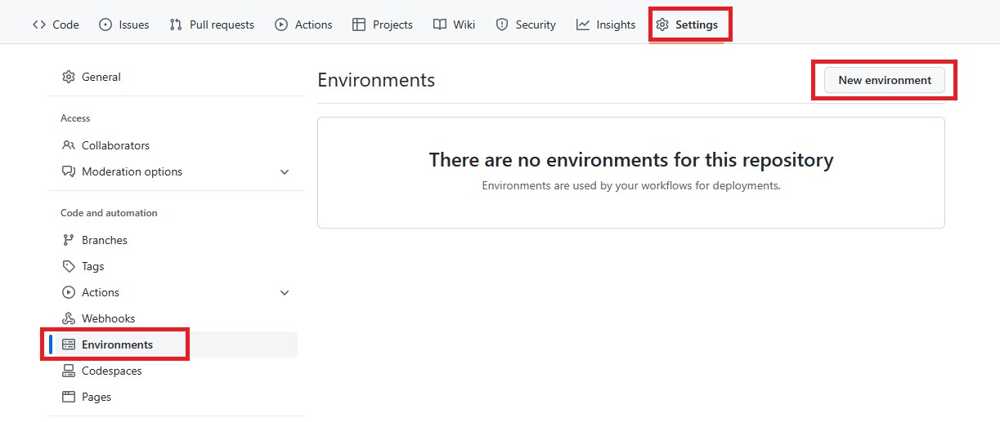
    
   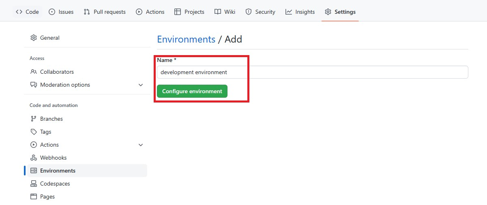

#### 2. Setup Production environment and Add an approval check for the production environment

Go to the **Settings** tab within your repo. Select **Environments**. Create a **new environment**. Enter a name (For ex- ```production environment```). Select **Configure environment**. Select **Required reviewers** and add your GitHub account id. Click **Save protection rules**.
    
   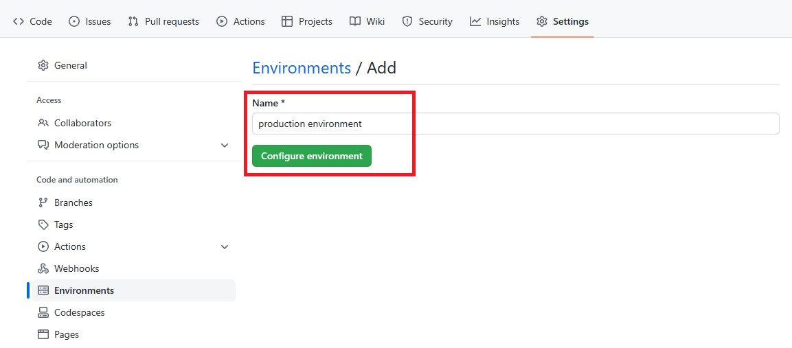
    
   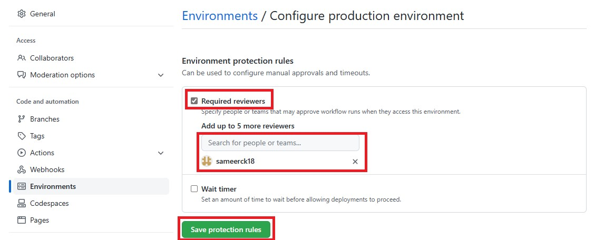

## Exercise 2: Use environments in GitHub Actions

Create one GitHub Actions workflow, triggered by changes being pushed to the main branch, with two jobs:

- The experiment job that trains the model using the wine-quality dataset in the development environment.
- The production job that trains the model in the production environment.

Add a condition that the production job is only allowed to run when the experiment job ran successfully. Success means that the Azure Machine Learning job ran successfully too.

### Define the GitHub Actions workflow:

Goto ```/.github/workflows/``` folder in cycle-2 branch in your repo. Select **Add file** and **Create new file**. Give name (For ex- ```04_environment.yaml```) and paste the following code after changing the ```<rg-name>``` to your **resource group** name from Azure portal and ```<ml-workspace-name>``` to your **Azure ML workspace** name. Select Commit.
    
   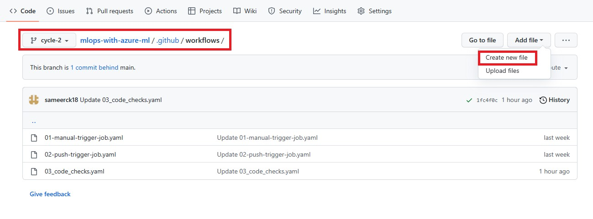
   
   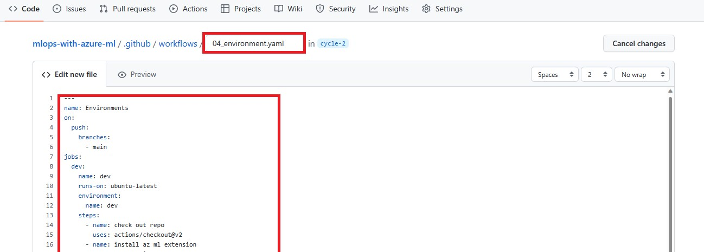

```yaml
---
name: Environments
on:
  push:
    branches:
      - main
jobs:
  dev:
    name: dev
    runs-on: ubuntu-latest
    environment:
      name: development environment
    steps:
      - name: check out repo
        uses: actions/checkout@v2
      - name: install az ml extension
        run: az extension add -n ml -y
      - name: azure login
        uses: azure/login@v1
        with:
          creds: ${{secrets.AZURE_CREDENTIALS}}
      - name: set current directory
        run: cd src
      - name: Run dev env job
        run: az ml job create --file src/development.yaml --resource-group <rg-name> --workspace-name <ml-workspace-name> --stream
  prod:
    name: prod
    needs: dev
    runs-on: ubuntu-latest
    environment:
      name: production environment
    steps:
      - name: check out repo
        uses: actions/checkout@v2
      - name: install az ml extension
        run: az extension add -n ml -y
      - name: azure login
        uses: azure/login@v1
        with:
          creds: ${{secrets.AZURE_CREDENTIALS}}
      - name: set current directory
        run: cd src
      - name: Run prod env job
        run: az ml job create --file src/production.yaml --resource-group <rg-name> --workspace-name <ml-workspace-name> --stream  
```

The above workflow will run experiment job in ```development environment``` and the production job, will run in ```production environment```, is only allowed to run when the experiment job ran successfully. Adding ```needs: dev``` to the workflow will wait for experiment job to run successfully before running production job. 

### Define experiment job to run in **development environment**:

Goto ```src```folder in cycle-2 branch in your repo. Select **Add file** and **Create new file**. Give name (For ex- ```development.yaml```) and paste the following code after changing the ```<Compute Cluster name>``` to your **Compute cluster name** from your Azure ML workspace. Select Commit.

```yaml
$schema: https://azuremlschemas.azureedge.net/latest/commandJob.schema.json
code: model
command: >-
  python main.py 
  --training_data ${{inputs.training_data}}
inputs:
  training_data: 
    path: azureml:nyc-taxi-data:1
    mode: ro_mount  
environment: azureml:AzureML-sklearn-0.24-ubuntu18.04-py37-cpu@latest
compute: <Compute Cluster name>
experiment_name: nyc-taxi-fare-prices
description: Train a classification model on nyc taxi data to predict taxi fare prices.
```

   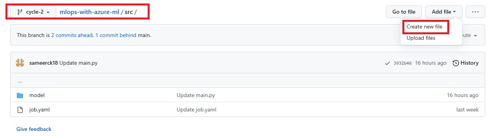
   
   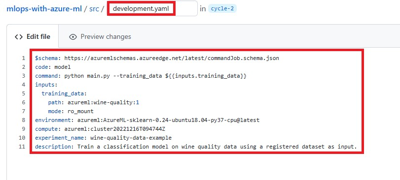

### Define production job to run in **production environment**:

Goto ```src``` folder in cycle-2 branch in your repo. Select **Add file** and **Create new file**. Give name (For ex- ```production.yaml```) and paste the following code after changing the ```<Compute Cluster name>``` to your **Compute cluster name** from your Azure ML workspace. Select Commit.
You can also use different input training data by creating one more **Data assets** in Azure ML workspace with different Data source and change the ```path``` accordingly.

```yaml
$schema: https://azuremlschemas.azureedge.net/latest/commandJob.schema.json
code: model
command: >-
  python main.py 
  --training_data ${{inputs.training_data}}
inputs:
  training_data: 
    path: azureml:nyc-taxi-data:1
    mode: ro_mount  
environment: azureml:AzureML-sklearn-0.24-ubuntu18.04-py37-cpu@latest
compute: <Compute Cluster name>
experiment_name: nyc-taxi-fare-prices
description: Train a classification model on nyc taxi data to predict taxi fare prices.
```
  
   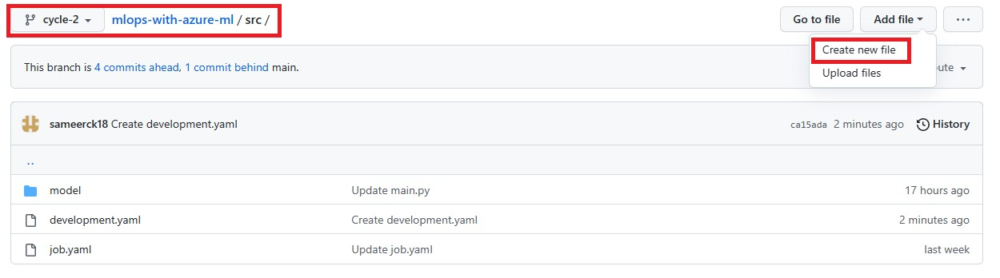
   
   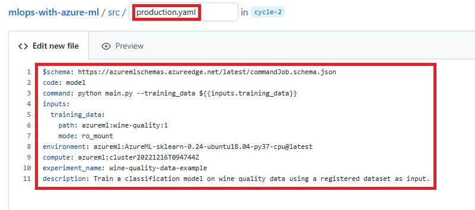

### Creating pull request

1. Navigate to the **Pull requests** tab in your repo. Select **New pull request** and select ```base:main``` and ```compare:cycle-2```. Click **Create pull request**.

    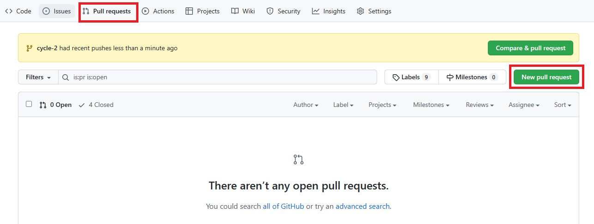
   
    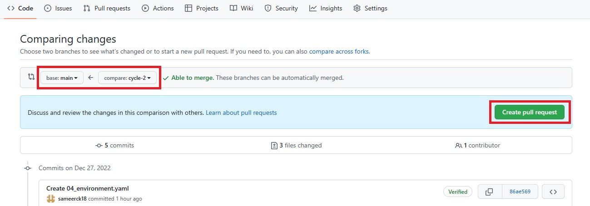
   
    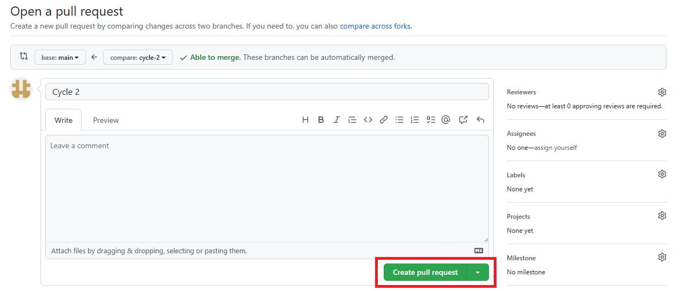
    
2. Now you can also see that, ```linting and unit test``` checks will also run. After all the checks are successfull, Click on **Merge request** and **Confirm merge**.

    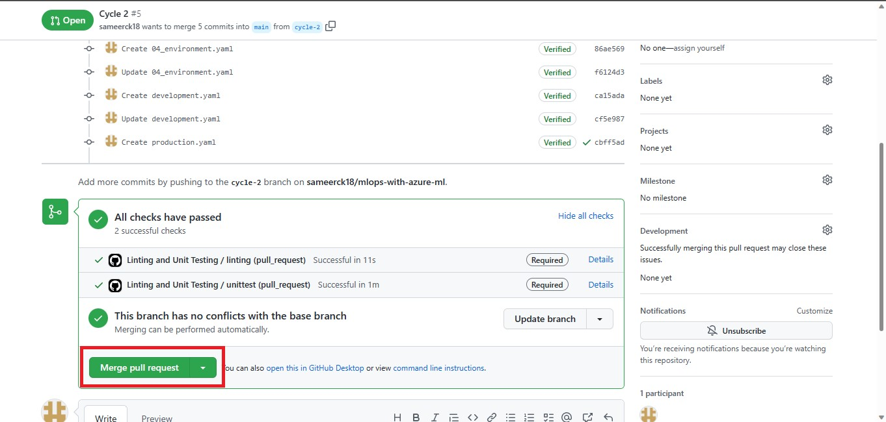
    
    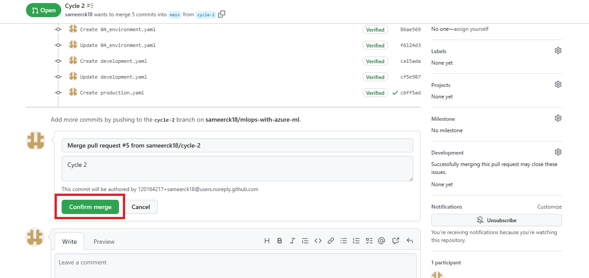
    
3. Now navigate to **Actions** tab and Select **Environments** workflow. Select the workflow running.

    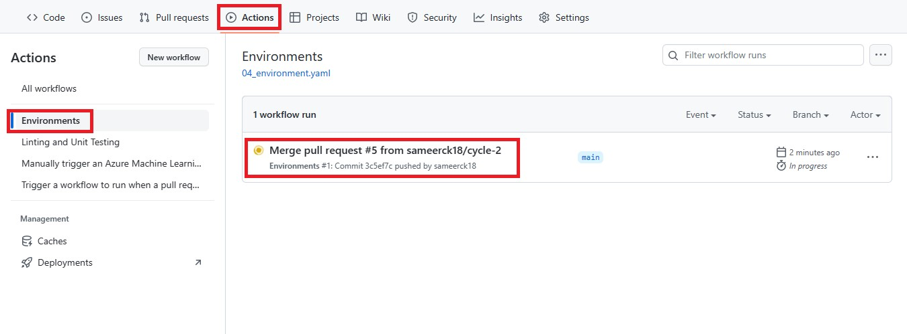
    
4. You can see pipeline where the workflow will run in ```development environment``` follwed by ```production environment```.

    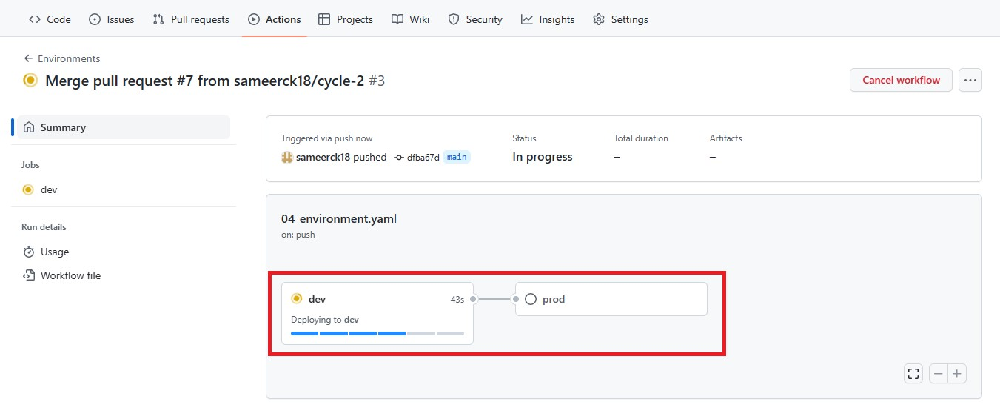
    
5. Once the workflow runs in development environment successfully, it will ask for review, because you added a approval check. Click on **Review deployments** and **✔️Check**  the ```production environment```. Select Approve and deploy.

    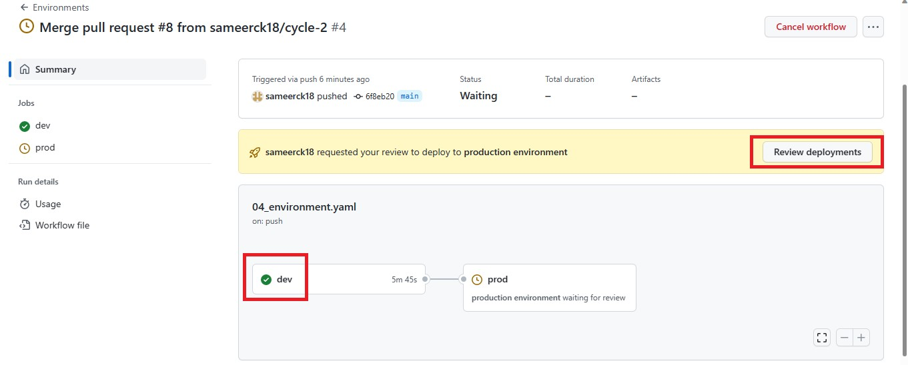
    
    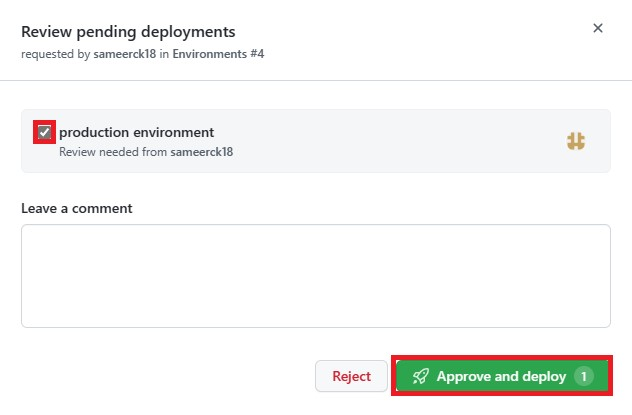

6. Now you can see that job is deploying into ```production environment``` and wait until workflow run successfully.

    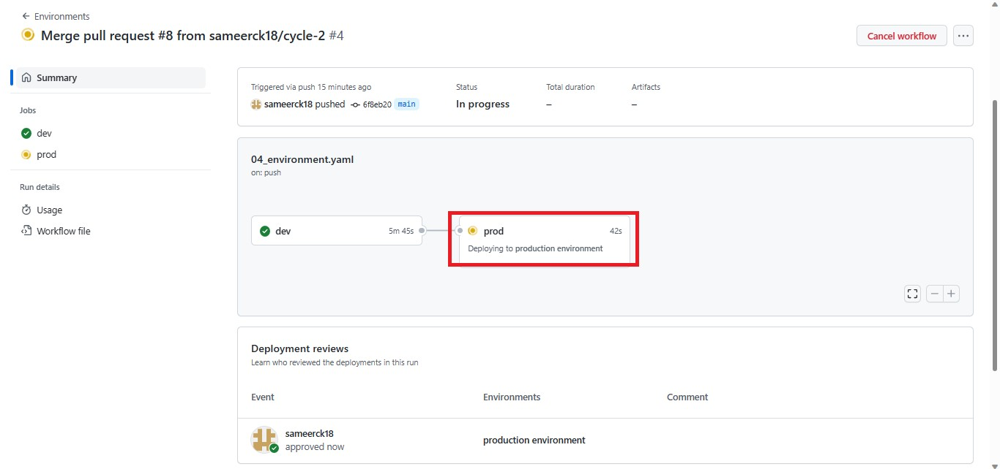
    
    

7. Now go to Azure ML workspace, navigate to **Jobs** > **All jobs**. You will see two job runs successfully.

    
